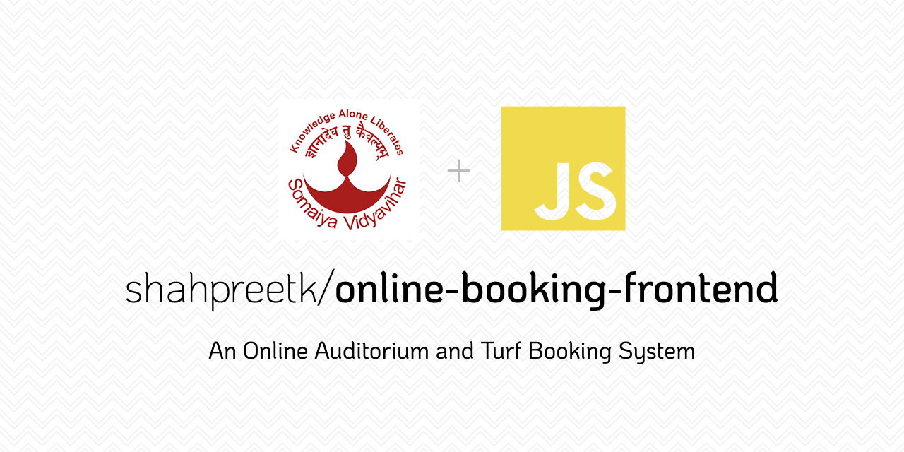

# ⚽️ Online Auditorium and Turf Booking System

### 👩‍🏫 Abstract

Ease of usage is the motive behind digitization in the 21st century. The basic human needs of food, shelter and clothing are now a click away and can be accessed with convenience through websites & apps like Zomato, Airbnb, Flipkart and Myntra to name a few. As of 2019, the world population is 7.6 billion people of which 4.66 billion are active internet users worldwide and the number is increasing every day. As we have paved our way towards the digitisation of the country, we realised that everything starts small. So, we looked around in our college and found that there is one aspect that could be upgraded to an automated software system and that’s how we came up with the idea of an Online Auditorium & Turf Booking System. Our website allows a user to book a turf or auditorium, multi-select the time slots, customize the bookings with addons, has a secure payment system with multiple payment options and a page to manage all the successful bookings. And all of this is available through simple user registration. Thus our framework increases the robustness of the booking procedure and at the same time simplifies the process, paving way for convenience, accessibility, reliability and feasibility.

### 📜 Introduction

The web applications in our daily life are growing and there is an increasing trend in the utilization of online booking apps which helps in reducing manual work and offer user comfort. At the moment, our college auditorium and turf booking system are in such a way that the user has to be physically present to finalise the reservation and make payments. To simplify and speed up this process, we came up with an online system wherein the user can book the auditorium and turf along with some additional features like purchasing add-ons and completing the payment on the web app itself. This empowers self-reliance and increases efficiency.

Currently, the traditional method of keeping records requires storing a hard copy of appointments. Retrieval of records in such cases and the need for large storage facilities are some serious limitations of manual record-keeping. BookIt is a website that will be used to make online booking of auditorium and turf present at K. J. Somaiya Institute of Engineering and Information Technology (KJSIEIT).

It uses the latest web technologies like React for frontend, Express server in the backend, NoSQL MongoDB database for storing data and stripe for secure payment gateway. It can be used by our college students and professors as well as outsiders to book the Auditorium and Turf. To conclude, BookIt will reduce the time spent for making a booking, the digital process will eliminate the need to physically check records, filtering and managing data will become easier and our project will increase the overall efficiency of the current system.

### 👩‍💻 Author

This project was built with ❤️ by [Preet Shah](https://github.com/shahpreetk).

### 🛠 Built with

UI - First, we sketched the wireframe of the website after which the prototype and designing were done on Adobe XD.

Frontend - The frontend of this online booking system is made using the Reactjs UI library. It helps in making a single-page application (SPA) that ensures fast rendering. React-Bootstrap with Styled Components has been used for the styling of the web app. To give the user a feeling of content being loaded, we show a loader using react-loading-skeleton after which the backend sends the data using Axios. The state management of the cart has been done using use-shopping-cart and the checkout is managed by Stripe payment system.

### 🔨 Installation and Setting it Up

If you are interested in setting up the project on your local machine you can simply follow these steps -

- Clone the repository

- In the root of the folder, make a new `.env` file

- In the `.env` file add your [Stripe Public/Publishable Key](https://stripe.com/docs/keys) as `REACT_APP_STRIPE_PUBLIC_KEY=YOUR_PUBLIC_KEY`

- Run `npm install`

- Run `npm start` and the project will be live!

### 🖥 Where can I find it?

You can find the frontend of BookIt [here](https://kjsieit-onlinebooking.netlify.app/)!!

And the backend of BookIt can be found [here](https://onlinebooking-backend.herokuapp.com)!!

The code to the backend of the project can be found at this [repository](https://github.com/shahpreetk/beproject-backend)!!

### 🙈 A kind request

This was my first complete MERN stack project and if you like it please do give it a star ⭐️.

Thank you!! 😁

### 📝 License

This project is licensed under [GNU General Public License v3.0
GNU GPLv3](https://spdx.org/licenses/GPL-3.0-or-later.html)
